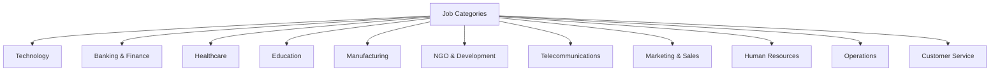
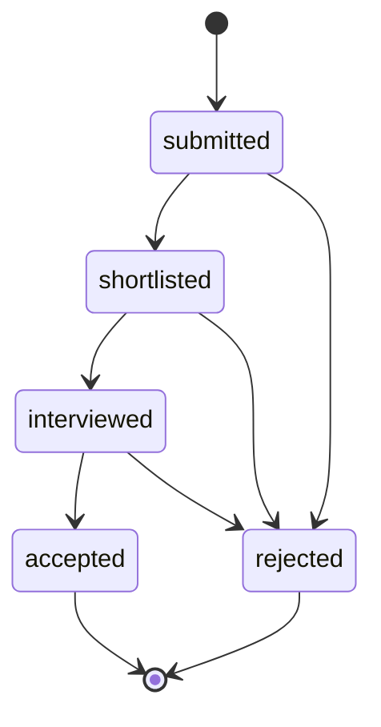

# Fix Mock Employer Data Design

## Overview

This design addresses the comprehensive improvement of the mock employer data file (`mockEmployerData.js`) in the HireHub Ethiopia employer frontend application. The current mock data has several issues including file format inconsistencies, incomplete Ethiopian context, and insufficient realism for testing purposes.

## Current Issues Analysis

### File Format Issues
- File uses `.js` extension but contains TypeScript interfaces
- Inconsistent with other frontend applications that use `.ts` files
- May cause type checking and development issues

### Data Quality Issues
- Limited variety of authentic Ethiopian companies
- Insufficient diversity in job types and industries
- Salary ranges may not reflect current Ethiopian market conditions
- Missing comprehensive Ethiopian context (locations, companies, cultural relevance)

### Structure Inconsistencies
- Data structure doesn't fully align with other mock data files in the ecosystem
- Missing some fields that might be required for comprehensive testing
- Inconsistent field naming conventions

## Architecture

### File Structure Enhancement
```
src/data/
├── mockEmployerData.ts (converted from .js)
├── types/
│   ├── employer.ts
│   └── job.ts
```

### Data Model Improvements

#### Enhanced Job Interface
```typescript
interface MockEmployerJob {
  id: string;
  title: string;
  description: string;
  requirements: string[];
  benefits: string[];
  location: string;
  employment_type: 'full_time' | 'part_time' | 'contract' | 'internship';
  category: string;
  experience_level: 'Entry' | 'Mid' | 'Senior' | 'Executive';
  salary_min?: number;
  salary_max?: number;
  currency: 'ETB';
  deadline: string;
  status: 'draft' | 'pending' | 'approved' | 'rejected' | 'closed';
  created_at: string;
  updated_at: string;
  application_count: number;
  views: number;
  is_premium: boolean;
  is_featured?: boolean;
  skills_required: string[];
  remote_allowed?: boolean;
  urgent?: boolean;
}
```

#### Enhanced Application Interface
```typescript
interface MockJobApplication {
  id: string;
  job_id: string;
  applicant_name: string;
  applicant_email: string;
  phone: string;
  resume_url: string;
  cover_letter: string;
  status: 'submitted' | 'shortlisted' | 'interviewed' | 'accepted' | 'rejected';
  applied_at: string;
  updated_at: string;
  experience_years: number;
  current_salary?: string;
  expected_salary?: string;
  skills: string[];
  education: string;
  location: string;
  notes?: string;
  rating?: number; // 1-5 scale
  interview_date?: string;
}
```

### Enhanced Ethiopian Context Integration

#### Authentic Ethiopian Companies
- **Banking Sector**: Zemen Bank, Commercial Bank of Ethiopia, Awash Bank, Dashen Bank
- **Technology**: Gebeya, Delivery Addis, Ride, Koga Labs
- **Telecommunications**: Ethio Telecom, Safaricom Ethiopia
- **Manufacturing**: Tufik Manufacturing, Bambis, Crown Cork
- **Healthcare**: CURE Ethiopia, Black Lion Hospital
- **Education**: AAU, IBS, Unity University
- **NGOs**: Concern Worldwide Ethiopia, Save the Children Ethiopia

#### Ethiopian Locations
- Major cities: Addis Ababa, Dire Dawa, Bahir Dar, Hawassa, Mekelle, Jimma, Adama
- Specific areas in Addis Ababa: Bole, Kazanchis, Megenagna, CMC, Gerji

#### Market-Appropriate Salary Ranges (ETB)
- **Entry Level**: 15,000 - 25,000 ETB
- **Mid Level**: 25,000 - 45,000 ETB  
- **Senior Level**: 45,000 - 80,000 ETB
- **Executive Level**: 80,000 - 150,000 ETB

## Data Enhancement Strategy

### Job Categories Expansion


### Application Status Flow


### Mock Data Composition

#### Job Distribution by Industry
| Industry | Number of Jobs | Percentage |
|----------|---------------|------------|
| Technology | 8 | 32% |
| Banking & Finance | 5 | 20% |
| Healthcare | 3 | 12% |
| Education | 3 | 12% |
| Manufacturing | 2 | 8% |
| NGO | 2 | 8% |
| Telecommunications | 2 | 8% |

#### Employment Type Distribution
| Type | Count | Usage Scenarios |
|------|-------|----------------|
| Full-time | 18 | Primary employment testing |
| Part-time | 4 | Flexible work testing |
| Contract | 2 | Project-based testing |
| Internship | 1 | Entry-level testing |

### Enhanced Application Data

#### Applicant Demographics
- **Name diversity**: Authentic Ethiopian names (Amharic, Oromo, Tigrinya origins)
- **Location spread**: Applications from various Ethiopian cities
- **Educational background**: Local universities and international institutions
- **Experience range**: 0-15 years across different fields

#### Skills Database
- **Technical Skills**: React, Angular, Java, Python, SQL, AWS, etc.
- **Soft Skills**: Communication, Leadership, Problem-solving
- **Domain Skills**: Banking, Healthcare, Education-specific knowledge
- **Language Skills**: Amharic, English, Arabic, local languages

## Testing Strategy

### Mock Data Validation Rules
- All salary ranges must be in ETB currency
- Phone numbers must follow Ethiopian format (+251XXXXXXXXX)
- Email addresses must be realistic and diverse
- Company names must be authentic Ethiopian businesses
- Locations must be real Ethiopian cities/areas

### Data Consistency Checks
- Job IDs referenced in applications must exist
- Application counts must match actual application records
- Status transitions must follow logical flow
- Date ranges must be realistic and consistent

### Coverage Requirements
- Minimum 25 job postings across all categories
- Minimum 50 applications distributed across jobs
- All employment types represented
- All application statuses represented
- Geographic distribution across major Ethiopian cities

## Implementation Phases

### Phase 1: File Structure Conversion
1. Rename file from `.js` to `.ts`
2. Extract interfaces to separate type files
3. Update import statements in consuming components
4. Ensure TypeScript compilation compatibility

### Phase 2: Data Enhancement
1. Expand job postings with authentic Ethiopian companies
2. Add comprehensive application data
3. Implement realistic salary ranges
4. Add missing fields (skills, ratings, interview dates)

### Phase 3: Data Validation
1. Implement data consistency checks
2. Validate Ethiopian context authenticity
3. Test data integration with UI components
4. Verify mock authentication compatibility

### Phase 4: Documentation Update
1. Update README with new data structure
2. Add developer guidelines for mock data usage
3. Document testing scenarios
4. Create data maintenance procedures

## Quality Assurance

### Data Authenticity Verification
- Company names verified against real Ethiopian businesses
- Salary ranges researched from Ethiopian job market
- Locations verified as real Ethiopian places
- Cultural context reviewed for appropriateness

### Technical Validation
- TypeScript type checking passes
- No circular dependencies
- Consistent naming conventions
- Proper data relationships

### Testing Compatibility
- Mock data supports all UI testing scenarios
- Authentication fallback mechanisms work
- Data pagination and filtering work correctly
- Search functionality operates properly