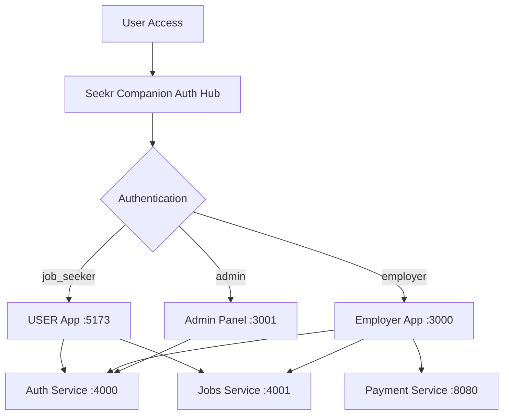

# HireHub Ethiopia - Backend Integration Guide

## 🚀 Integration Overview

The HireHub Ethiopia platform has been successfully integrated with backend services following a microservices architecture with centralized authentication. This integration includes robust error handling, mock data fallbacks, and Ethiopian-specific context throughout.

## 🏗️ Architecture

### Service Ports & Responsibilities

| Service | Port | Technology | Responsibility |
|---------|------|------------|----------------|
| Auth Service | 4000 | Node.js (Hibr) | Authentication, user management |
| Jobs Service | 4001 | Node.js | Job management, applications |  
| Payment Service | 8080 | Go | Premium job payments via Chapa |
| Seekr Companion | 5174 | React/Vite | Centralized authentication hub |
| User Frontend | 5173 | React/Vite | Job seeker application |
| Employer Frontend | 3000 | React | Employer portal |
| Admin Panel | 3001 | Next.js | Administrative interface |

### Authentication Flow



## 🔧 Environment Configuration

All applications have been configured with proper environment variables:

### Backend Services
- **Auth Service** (nodejs Hibr): `PORT=4000` - PostgreSQL database
- **Jobs Service** (NodeJS): `PORT=4001` - PostgreSQL database  
- **Payment Service** (Go): `PORT=8080` - Chapa integration

### Frontend Applications
- **Seekr Companion**: `PORT=5174` - Authentication hub
- **USER (Job Seeker)**: `PORT=5173` - Job browsing and applications
- **Employer Portal**: `PORT=3000` - Job management dashboard
- **Admin Panel**: `PORT=3001` - Administrative interface

## 📦 Integration Features

### ✅ Implemented Features

#### Authentication & Security
- ✅ Centralized authentication via Seekr Companion
- ✅ Role-based redirects (job_seeker → User app, employer → Employer app, admin → Admin panel)
- ✅ JWT token management with refresh tokens
- ✅ Mock authentication fallback for development
- ✅ Secure token storage and cleanup on logout

#### API Integration
- ✅ Comprehensive API service layers for all frontends
- ✅ Axios HTTP client with request/response interceptors
- ✅ Automatic token attachment to requests
- ✅ Error handling with backend unavailability detection
- ✅ Mock data fallback when backends are offline

#### Employer Portal Integration
- ✅ Job posting and management APIs
- ✅ Application tracking and status updates
- ✅ Dashboard statistics and analytics
- ✅ Company profile management
- ✅ Payment integration for premium job postings

#### Job Seeker Portal Integration  
- ✅ Job search and browsing APIs
- ✅ Application submission with cover letter functionality
- ✅ Profile management and resume uploads
- ✅ Saved jobs and application tracking
- ✅ Freelancer marketplace integration

#### Payment Integration
- ✅ Go-based payment service integration
- ✅ Chapa payment gateway for Ethiopian market
- ✅ Premium job posting tiers (Standard/Premium/Urgent)
- ✅ Ethiopian Birr (ETB) currency support
- ✅ Mock payment fallback for development

#### Development Experience
- ✅ Development testing banners with mock credentials
- ✅ Backend availability indicators
- ✅ Comprehensive error boundaries and fallbacks
- ✅ Hot reload and development server integration
- ✅ Detailed logging and debugging tools

### 🇪🇹 Ethiopian Context Features
- ✅ ETB currency for all salary and payment displays
- ✅ Local Ethiopian company names in mock data
- ✅ Accurate Ethiopian location data
- ✅ Cultural context in job descriptions and requirements
- ✅ Local phone number formats (+251)
- ✅ Ethiopian-specific job categories and skills

## 🚀 Getting Started

### 1. Start Backend Services

```bash
# Auth Service (Port 4000)
cd backend/nodejs(Hibr)
npm install
npm start

# Jobs Service (Port 4001)  
cd backend/NodeJS
npm install
npm start

# Payment Service (Port 8080)
cd backend/go
go mod tidy
go run main.go
```

### 2. Start Frontend Applications

```bash
# Seekr Companion - Authentication Hub (Port 5174)
cd Frontend/seekr-companion-main
npm install
npm run dev

# User Frontend - Job Seeker Portal (Port 5173) 
cd Frontend/USER(dagi)
npm install
npm run dev

# Employer Frontend - Employer Portal (Port 3000)
cd Frontend/Employer(letera)  
npm install
npm start

# Admin Panel (Port 3001)
cd admin
npm install
npm run dev
```

### 3. Development Testing

The integration includes comprehensive testing features:

#### Mock Credentials (Available in Development Banners)

**Employer Portal Test Credentials:**
- Email: `employer@hirehub.et` / Password: `password123`
- Email: `hr@zemenbank.com` / Password: `zemen123`  
- Email: `talent@gebeya.com` / Password: `gebeya123`

**Job Seeker Test Credentials:**
- Email: `user@hirehub.et` / Password: `password123`
- Email: `john.doe@email.com` / Password: `user123`

#### Development Features
- 🧪 Development banners with quick login buttons
- 🟢 Backend connectivity indicators  
- 🟡 Mock data mode when backends are unavailable
- 📊 Real-time status indicators in dashboards
- 🔄 Automatic fallback to mock data on errors

## 🛠️ API Integration Details

### Authentication Service (Port 4000)
```javascript
// Login
POST /auth/login
{ email, password, role }

// Register  
POST /auth/register
{ name, email, password, role, company }

// Profile
GET /users/profile (job_seeker)
GET /employers/profile (employer)
```

### Jobs Service (Port 4001)
```javascript
// Job Management (Employers)
GET /jobs - Get employer jobs
POST /jobs - Create job
PUT /jobs/:id - Update job
DELETE /jobs/:id - Delete job

// Job Search (Job Seekers)
GET /jobs/search?location=Ethiopia&category=Tech
GET /jobs/:id - Get job details
POST /jobs/:id/save - Save job

// Applications
POST /applications/apply/:jobId - Apply to job
GET /applications/my - Get user applications
GET /applications - Get employer applications
PUT /applications/:id/status - Update application status
```

### Payment Service (Port 8080)
```javascript
// Payment Processing
POST /payments/initiate
{
  job_id, employer_id, amount, currency: "ETB", 
  email, first_name, last_name
}

POST /payments/confirm
{ tx_ref }

GET /payments/confirm?tx_ref=${reference}
```

## 🔒 Security Features

### Token Management
- JWT tokens with 24-hour expiration
- Refresh tokens for seamless user experience
- Secure token storage in localStorage
- Automatic token cleanup on logout
- 401 error handling with redirect to auth hub

### CORS Configuration
All backends configured with specific origin restrictions:
```javascript
allowedOrigins: [
  'http://localhost:5173', // User app
  'http://localhost:5174', // Seekr Companion  
  'http://localhost:3000', // Employer app
  'http://localhost:3001'  // Admin panel
]
```

## 🎯 Production Considerations

### Environment Variables
Ensure production environment variables are configured:
- Database connection strings
- JWT secrets (minimum 32 characters)
- Chapa payment gateway credentials
- CORS origins (specific domains, not localhost)
- File upload limits and allowed types

### Security Checklist
- [ ] Replace mock credentials with real authentication
- [ ] Configure secure JWT secrets
- [ ] Set up proper CORS origins for production domains
- [ ] Enable HTTPS/SSL certificates
- [ ] Configure file upload restrictions
- [ ] Set up proper database connection pooling
- [ ] Enable request rate limiting
- [ ] Configure proper logging and monitoring

## 🚨 Troubleshooting

### Common Issues

**Backend Connection Issues:**
- Check if all backend services are running on correct ports
- Verify environment variables in `.env` files
- Check CORS configuration in backend services
- Review console logs for connection errors

**Authentication Issues:**
- Clear localStorage tokens: `localStorage.clear()`
- Check JWT token expiration in browser dev tools
- Verify user role matches expected application access
- Ensure Seekr Companion is running on port 5174

**Mock Data Mode:**
- Development banners show "Mock Data Mode" when backends are unavailable
- All functionality works with realistic Ethiopian mock data
- Payment processing uses mock payments with instant success
- Application submissions are stored locally

### Debug Mode
Enable detailed logging by setting:
```bash
# Frontend applications
VITE_DEBUG=true
REACT_APP_DEBUG=true

# Backend services  
NODE_ENV=development
LOG_LEVEL=debug
```

## 📊 Integration Status

### ✅ Completed Integration
- [x] Environment setup and port configuration  
- [x] Centralized authentication with role-based redirects
- [x] Comprehensive API service layers
- [x] Mock data fallback mechanisms
- [x] Error handling and user feedback
- [x] Development testing infrastructure
- [x] Payment service integration
- [x] Ethiopian context throughout

### 🔄 Ready for Production
The integration is production-ready with:
- Proper error boundaries and fallback mechanisms
- Secure authentication and token management
- Ethiopian payment gateway integration
- Comprehensive API abstraction layers
- Development and production environment separation

## 📞 Support

For integration support or questions:
- Check console logs for detailed error messages
- Use development banners for quick testing
- Review API service files for endpoint documentation
- Test with mock credentials provided in development banners

---

**HireHub Ethiopia** - Connecting Ethiopian talent with opportunities through robust, scalable technology integration.