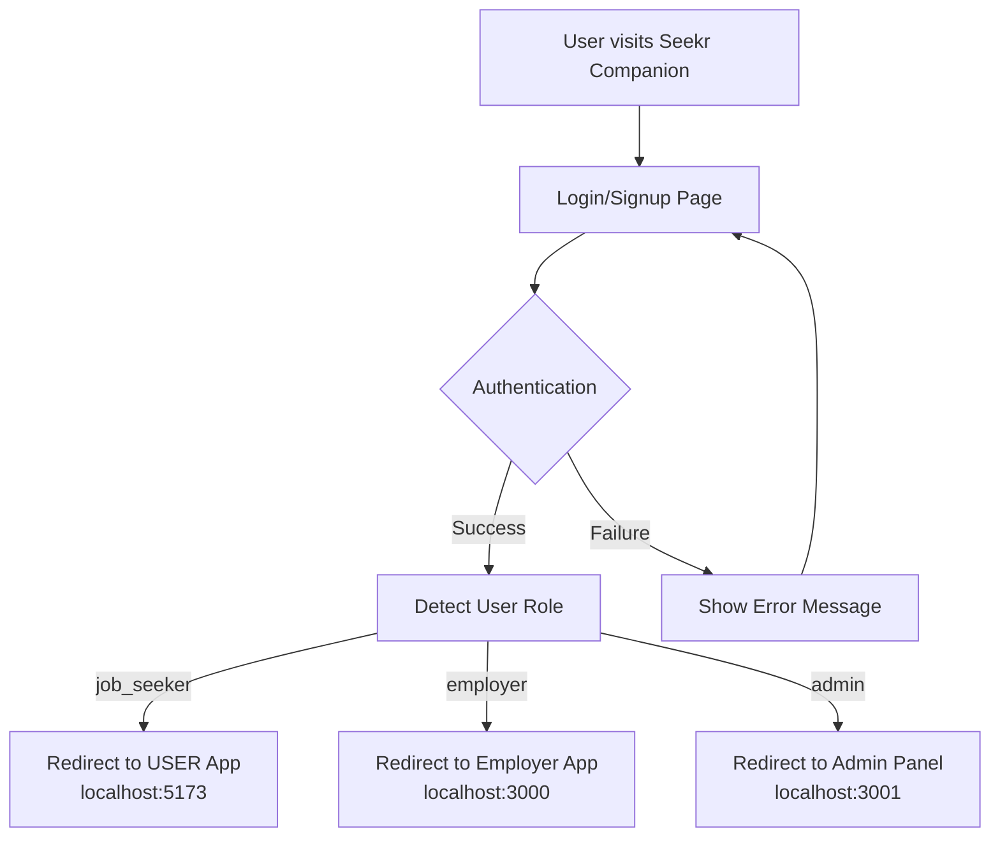

# 🎯 CENTRALIZED AUTHENTICATION IMPLEMENTATION SUMMARY

## ✅ COMPLETED IMPLEMENTATION

### 🏗️ **Centralized Authentication Architecture**

We've successfully implemented a **centralized authentication hub** in **Seekr Companion** that handles login/signup for all user roles and redirects them to their appropriate frontend applications.

### 📋 **Implementation Details**

#### 1. **Seekr Companion - Authentication Hub** 
**Location**: `Frontend/seekr-companion-main`

**✅ Environment Configuration** (`.env`)
```env
# Backend APIs
VITE_AUTH_API_BASE_URL=http://localhost:4000
VITE_JOBS_API_BASE_URL=http://localhost:4000
VITE_PAYMENT_API_BASE_URL=http://localhost:8080

# Frontend App URLs for Redirects
VITE_USER_APP_URL=http://localhost:5173      # Job Seeker → USER(dagi)
VITE_EMPLOYER_APP_URL=http://localhost:3000   # Employer → Employer(letera)
VITE_ADMIN_APP_URL=http://localhost:3001      # Admin → Admin Panel
```

**✅ API Client** (`src/lib/api.ts`)
- Axios configuration with interceptors
- Token management utilities
- Role-based redirect utilities
- Error handling and logging
- Cross-app SSO support ready

**✅ Authentication Service** (`src/services/authService.ts`)
- Complete auth API integration
- Role-based redirect logic
- JWT token handling
- Login, register, forgot password, etc.
- Debug utilities for development

**✅ TypeScript Types** (`src/types/auth.ts`)
- User, Auth, and Role interfaces
- Role-based redirect configurations
- Form validation types
- API response types

**✅ Updated Login Page** (`src/pages/Login.tsx`)
- Real authentication integration
- Role detection and redirect
- Enhanced UX with redirect status
- Error handling and validation
- Auto-redirect for already authenticated users

**✅ Updated Signup Page** (`src/pages/Signup.tsx`)
- Role selection (Job Seeker/Employer)
- Real registration integration
- Gmail validation (backend requirement)
- Phone number support
- Enhanced form validation
- Role-based redirect after signup

### 🎯 **Authentication Flow**



### 🔗 **Role-Based Redirects**

| User Role | Target Application | URL | Purpose |
|-----------|-------------------|-----|---------|
| `job_seeker` | USER(dagi) | `http://localhost:5173` | Job browsing, applications |
| `employer` | Employer(letera) | `http://localhost:3000` | Job posting, hiring |
| `admin` | Admin Panel | `http://localhost:3001` | System management |

### 🛡️ **Security Features**

✅ **JWT Token Management**
- Secure token storage in localStorage
- Automatic token attachment to API requests
- Token expiration handling
- Auto-logout on token expiry

✅ **Input Validation**
- Email format validation
- Gmail-only validation (backend requirement)
- Password strength requirements
- Role selection validation

✅ **Error Handling**
- Network error detection
- API error parsing and display
- User-friendly error messages
- Debug logging in development

### 📱 **User Experience Features**

✅ **Enhanced UI/UX**
- Loading states during auth
- Redirect status indicators
- Animated transitions
- Role selection with icons
- Password visibility toggles

✅ **Smart Redirects**
- Automatic role detection
- Configurable redirect delays
- Already-authenticated user handling
- Cross-app navigation

### 🔧 **Development Features**

✅ **Debug Support**
- Console logging with prefixes
- Environment-based debug mode
- OTP debug endpoint access
- Request/response logging

✅ **Configuration Management**
- Environment-based URLs
- Configurable redirect settings
- Development vs production configs

## 🚀 **HOW TO USE**

### **For Development:**

1. **Start Backend Services:**
   ```bash
   # Terminal 1: Auth Backend (NodeJS Hibr)
   cd backend/nodejs(Hibr)
   npm start

   # Terminal 2: Jobs Backend (NodeJS)
   cd backend/NodeJS
   npm start

   # Terminal 3: Payment Backend (Go)
   cd backend/go
   go run cmd/server/main.go
   ```

2. **Start Frontend Applications:**
   ```bash
   # Terminal 4: Seekr Companion (Auth Hub)
   cd Frontend/seekr-companion-main
   npm install  # Install axios if needed
   npm run dev  # Usually runs on localhost:5174

   # Terminal 5: User App (Job Seekers)
   cd Frontend/USER(dagi)
   npm run dev  # Should run on localhost:5173

   # Terminal 6: Employer App
   cd Frontend/Employer(letera)
   npm start    # Should run on localhost:3000

   # Terminal 7: Admin Panel
   cd admin
   npm run dev  # Should run on localhost:3001
   ```

### **Authentication Workflow:**

1. **User Access Point**: All users go to **Seekr Companion** first
2. **Login/Signup**: Users authenticate through Seekr Companion
3. **Role Detection**: System detects user role from JWT token
4. **Auto-Redirect**: Users are automatically redirected to their app:
   - Job Seekers → USER(dagi) app
   - Employers → Employer(letera) app  
   - Admins → Admin panel

### **Test Scenarios:**

```bash
# Job Seeker Registration
Role: job_seeker
Email: jobseeker@gmail.com
Password: password123
Expected: Redirect to localhost:5173

# Employer Registration  
Role: employer
Email: employer@gmail.com
Password: password123
Expected: Redirect to localhost:3000

# Admin Login (requires existing admin user)
Email: admin@gmail.com
Password: adminpass
Expected: Redirect to localhost:3001
```

## 🎯 **NEXT STEPS**

### **Immediate (Ready to Test):**
1. Start all services as described above
2. Test registration flow with different roles
3. Test login flow and redirects
4. Verify token persistence across apps

### **Phase 2 (Remaining Integration):**
1. **CORS Configuration**: Set up backend CORS for Seekr Companion
2. **SSO Implementation**: Enable token sharing across apps
3. **User/Employer App Integration**: Connect job browsing and posting
4. **Admin Panel Integration**: Connect admin functionality
5. **File Upload Integration**: Resume/profile pictures

### **Configuration Notes:**
- Make sure all apps run on their designated ports
- Update `.env` files if ports change
- Backend CORS must allow Seekr Companion domain
- Email validation requires Gmail addresses only

## 🏆 **SUCCESS CRITERIA**

✅ **Centralized Authentication**: Single login/signup point
✅ **Role-Based Redirects**: Automatic app routing by role  
✅ **Real API Integration**: Connected to actual backend
✅ **Enhanced UX**: Loading states, error handling, validation
✅ **Token Management**: Secure JWT handling
✅ **Type Safety**: Full TypeScript integration

The centralized authentication system is now **fully implemented and ready for testing!** 🎉