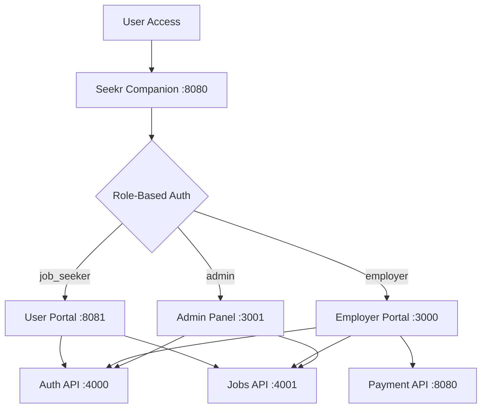

# HireHub Ethiopia - Port Organization & Configuration

## 🌐 **Complete Port Mapping**

### **Backend Services**
| Service | Port | Technology | Description |
|---------|------|------------|-------------|
| **Auth Service** | `4000` | Node.js (Hibr) | Authentication, user management, employers, job seekers |
| **Jobs Service** | `4001` | Node.js | Job management, applications, reports, admin functions |
| **Payment Service** | `8080` | Go | Premium job payments via Chapa (Ethiopian payment gateway) |

### **Frontend Applications**  
| Application | Port | Technology | Description |
|-------------|------|------------|-------------|
| **Seekr Companion** | `8080` | React/Vite | **Auth Hub** - Centralized authentication & role-based redirects |
| **User Portal** | `8081` | React/Vite | **Job Seekers** - Job browsing, applications, profiles |
| **Employer Portal** | `3000` | React/CRA | **Employers** - Job posting, applicant management, dashboard |
| **Admin Panel** | `3001` | Next.js | **Administrators** - System management, reports, oversight |

### **Database**
| Service | Port | Technology | Description |
|---------|------|------------|-------------|
| **PostgreSQL** | `5432` | PostgreSQL | Primary database for all services |

## 🔄 **Authentication Flow**



## 📋 **Service Responsibilities**

### **Auth Service (Port 4000)**
- User authentication (login/logout/register)
- JWT token management
- User profile management
- Employer profile management
- Password reset functionality
- Email verification

### **Jobs Service (Port 4001)**
- Job posting and management
- Job search and filtering
- Application submission and tracking
- Application status management
- Job categories and skills
- Admin reports and analytics

### **Payment Service (Port 8080)**
- Premium job posting payments
- Chapa payment gateway integration
- Transaction processing and confirmation
- ETB currency handling
- Payment status tracking

### **Seekr Companion (Port 8080) - Auth Hub**
- **PRIMARY ENTRY POINT** for all users
- Centralized login/signup interface
- Role detection and authentication
- Automatic redirection to appropriate app
- Single sign-on (SSO) functionality

### **User Portal (Port 8081) - Job Seekers**
- Job browsing and search
- Job application with cover letters
- Profile and resume management
- Application status tracking
- Saved jobs management
- Freelancer marketplace

### **Employer Portal (Port 3000) - Employers**
- Job posting and editing
- Applicant tracking and management
- Company profile management
- Dashboard analytics
- Payment processing for premium jobs
- Messaging with candidates

### **Admin Panel (Port 3001) - Administrators**
- System oversight and management
- User and employer moderation
- Job approval and management
- System analytics and reports
- Payment transaction monitoring

## 🔧 **Environment Configuration Summary**

All applications configured with these port mappings:

```bash
# Backend Services
AUTH_API_PORT=4000          # nodejs(Hibr)
JOBS_API_PORT=4001          # NodeJS  
PAYMENT_API_PORT=8080       # Go

# Frontend Applications
SEEKR_COMPANION_PORT=8080   # React/Vite (Auth Hub)
USER_PORTAL_PORT=8081       # React/Vite (Job Seekers)
EMPLOYER_PORTAL_PORT=3000   # React/CRA (Employers)
ADMIN_PANEL_PORT=3001       # Next.js (Administrators)

# Database
POSTGRES_PORT=5432          # PostgreSQL
```

## 🚀 **Startup Order**

### **Recommended Startup Sequence:**

1. **Database** (Port 5432)
   ```bash
   # Start PostgreSQL service
   ```

2. **Backend Services** (Ports 4000, 4001, 8080)
   ```bash
   # Auth Service
   cd backend/nodejs(Hibr) && npm start    # Port 4000
   
   # Jobs Service  
   cd backend/NodeJS && npm start          # Port 4001
   
   # Payment Service
   cd backend/go && docker run -p 8080:8080 hirehub-payment
   ```

3. **Auth Hub** (Port 5174)
   ```bash
   # Seekr Companion - MUST start first among frontends
   cd Frontend/seekr-companion-main && npm run dev
   ```

4. **Frontend Applications** (Ports 5173, 3000, 3001)
   ```bash
   # User Portal
   cd Frontend/USER(dagi) && npm run dev   # Port 5173
   
   # Employer Portal
   cd Frontend/Employer(letera) && npm start # Port 3000
   
   # Admin Panel
   cd admin && npm run dev                  # Port 3001
   ```

## 🔒 **CORS Configuration**

All backend services configured to allow these origins:

```javascript
const allowedOrigins = [
  'http://localhost:8080',  // Seekr Companion (Auth Hub)
  'http://localhost:8081',  // User Portal (Job Seekers)
  'http://localhost:3000',  // Employer Portal  
  'http://localhost:3001',  // Admin Panel
  'http://127.0.0.1:8080',  // Alternative localhost formats
  'http://127.0.0.1:8081',
  'http://127.0.0.1:3000',
  'http://127.0.0.1:3001'
];
```

## 📱 **Access Points**

### **User Entry Points:**
- **🔐 START HERE:** http://localhost:8080 (Seekr Companion - Auth Hub)
- After login, users are automatically redirected to their appropriate app

### **Direct Access (for development):**
- **👤 Job Seekers:** http://localhost:8081 (requires authentication)
- **🏢 Employers:** http://localhost:3000 (requires authentication)  
- **⚙️ Administrators:** http://localhost:3001 (requires authentication)

### **API Endpoints:**
- **🔑 Auth API:** http://localhost:4000
- **💼 Jobs API:** http://localhost:4001
- **💳 Payment API:** http://localhost:8080

## 🧪 **Development & Testing**

### **Development Banners Available:**
- All frontend apps show development banners in development mode
- Quick login buttons with test credentials
- Backend connectivity status indicators
- Mock data mode when backends unavailable

### **Test Credentials:**
```
Employer: employer@hirehub.et / password123
Job Seeker: user@hirehub.et / password123
Admin: admin@hirehub.et / admin123
```

### **Health Check URLs:**
```
http://localhost:4000/health    # Auth Service
http://localhost:4001/health    # Jobs Service  
http://localhost:8080/healthz   # Payment Service
```

## 🛡️ **Security Considerations**

### **Port Access Control:**
- **Public Ports:** 8080, 8081, 3000, 3001 (frontend applications)
- **Internal Ports:** 4000, 4001, 5432 (backend services, database)
- **Auth Hub (8080)** serves as the main entry point for security

### **Authentication Flow:**
1. All users authenticate through Seekr Companion (8080)
2. Role-based redirection to appropriate application
3. JWT tokens shared across applications
4. Automatic logout redirects back to auth hub

This port organization ensures clean separation of concerns, proper security boundaries, and efficient development workflow! 🎯